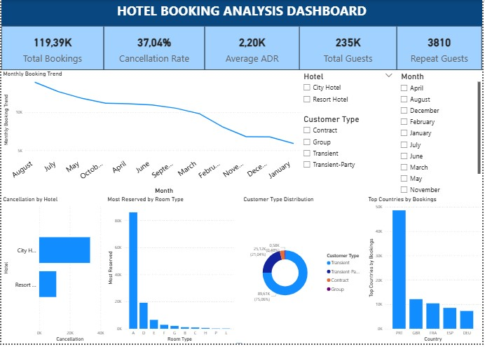

# Hotel Booking Analysis
## Project Overview
This project analyzes hotel booking data using SQL and Power BI to identify booking trends, customer behavior, cancellation rates, and room type preferences through interactive dashboard visualization.

---

## Tools Used
- SQL
- Power BI
- Data Visualization
- Dashboard Design

---

## Key Insights
- Total bookings reached 119K
- Cancellation rate was 37%
- Transient customers dominated bookings
- Portugal generated the highest number of reservations
- Room type A was the most reserved room type

---

## Dashboard Preview



---

## SQL Analysis Example

```sql
-- Most Reserved Room Type
SELECT 
reserved_room_type,
COUNT(*) AS total_booking
FROM hotel_bookings
GROUP BY reserved_room_type
ORDER BY total_booking DESC;
```

---

## Dashboard Features
- KPI cards for booking performance
- Monthly booking trend analysis
- Cancellation analysis by hotel type
- Customer type distribution
- Country-based booking analysis
- Interactive slicers and filters

---

## Files Included
- Hotel booking dashboard.pbix
- SQL_queries.sql
- Dashboard.jpg
- Hotel_bookings.csv
