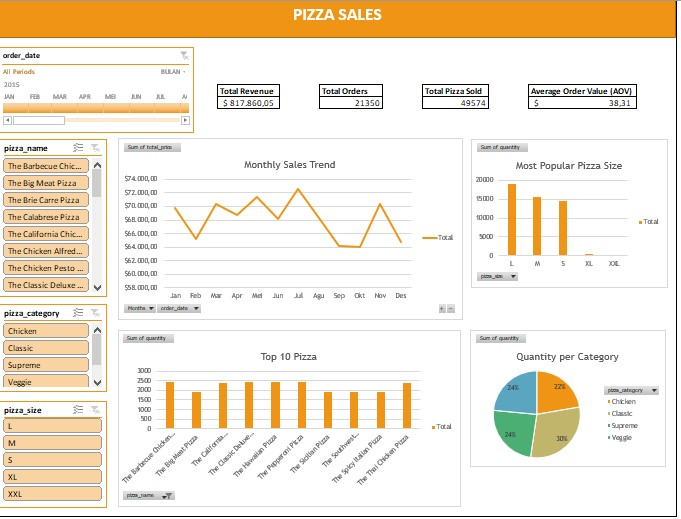

# Pizza Sales Analysis

## Project Overview
This project analyzes pizza sales data using SQL and Microsoft Excel to identify sales trends, customer preferences, and business performance through interactive dashboard visualization.

## Tools Used
- SQL
- Microsoft Excel
- Pivot Table
- Pivot Chart
- Data Visualization

## Key Insights
- Total revenue exceeded $817K
- Large pizzas were the most popular size
- Total orders reached 21K
- Classic category generated the highest sales quantity

## Dashboard Preview



## SQL Analysis Example

```sql
SELECT 
pizza_size,
SUM(quantity) AS total_sold
FROM pizza_sales
GROUP BY pizza_size
ORDER BY total_sold DESC;
```
